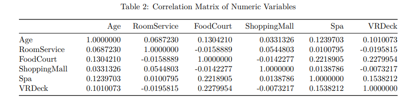

# predictive-modeling-spacetitanic

## Background
Spaceship Titanic is a machine learning competition on Kaggle sponsored by Google LLC. The Spaceship Titanic dataset consists of fictional records of passengers on board a spaceship named Titanic on its maiden voyage. The ship encountered a spacetime anomaly and half of its passengers were transported to an alternative dimension. The data seems to be sufficiently complex. The highest score in the competition so far is 0.88, which indicates that the data is as or even more complex than its earth counterpart, the real-world Titanic dataset, which many people have scored 1.00. Since the data is likely to be artificial, the distribution of certain variables may be different from that of the real-world. Assumptions valid for similar real-world variables could be invalid here. There are missing values in the dataset. The handling of missing values may require consideration of the fictional context. It is also reasonable to assume that the authors created certian randomness in the data, which may require some considerations to deal with.  

## Questions of Interest
In addition to predicting which passengers were transported to te alternative dimension, the current project attempts to investigate whether the probability of being transported differ between passengers. Are there specific set of risk features entailing the transportation to the alternative dimension? For example, do passengers of different age groups differ in their chance of being transported? And whether having VIP status contribute to the probability of being transported. 

## Samples of Analysis
### Exploratory analysis of categorical variables

### Checking the assumptions for logistic regression   

### Variable importance from the random forest model

### Logistic regression models with backword model selection
Different models were fitted with different ways of handling categorical variables, such as reducing the levels of some categories, and log-transforming the numerical variables to deal with the "zero-heavy" issue. Here is one of the models

### Find the "best" model with cross-validation
Model 1 and 2 are both doing well. Model 2 is more interpretable since the categorical variables have fewer levels, so it appears to be our "best" model here.   
    

## Results
Risk factors   
Statistical evidence is obtained suggesting that passengers were
not transported at random. There are 13 distinct features affecting the probability of being transported.
The recommendation from the current investigation to the spaceships in nearby areas and the passengers
on board are the following: Prioritize evacuating children who are Europa residents in cryosleep on the
starboard side of deck B, C, , or G, and are traveling to G 55 Cancri e. Direct passengers and crew unable
to evacuate to the port side of deck A and T. Passengers should be aware that spending in food courts and
shopping malls appear to slightly increase the risk of being transported while spending on room service, spa,
and VR deck seems to slightly decrease the risk of being transported.

Prediction

The prediction accuracy is almost at 80% which is a decent score among participants who are using relatively more traditional models